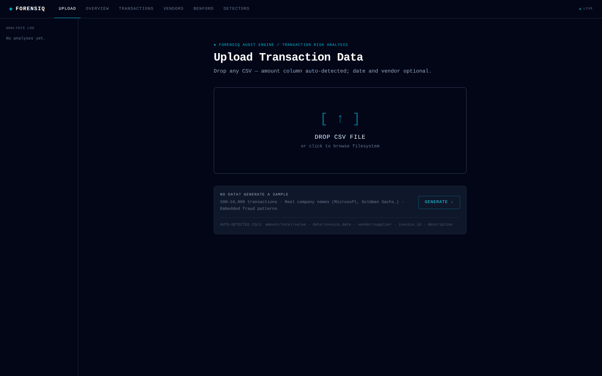
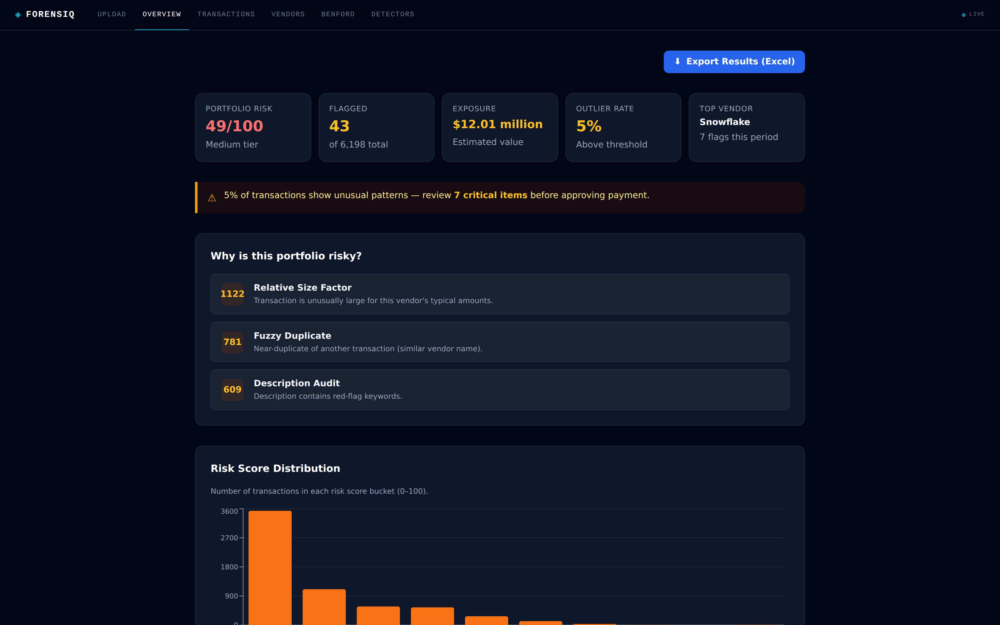
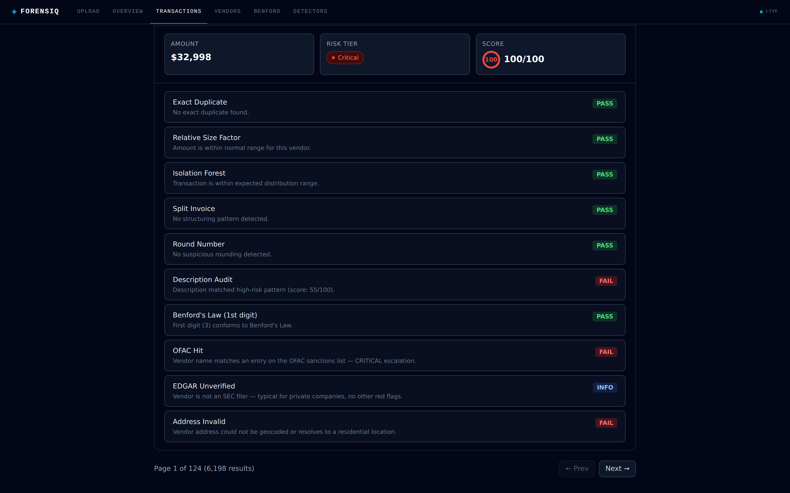
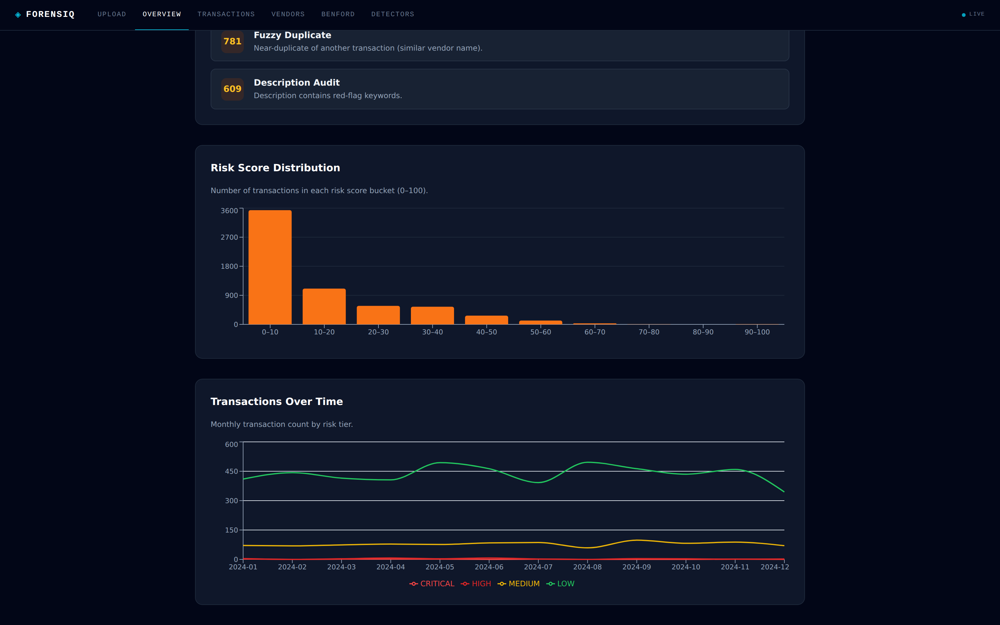
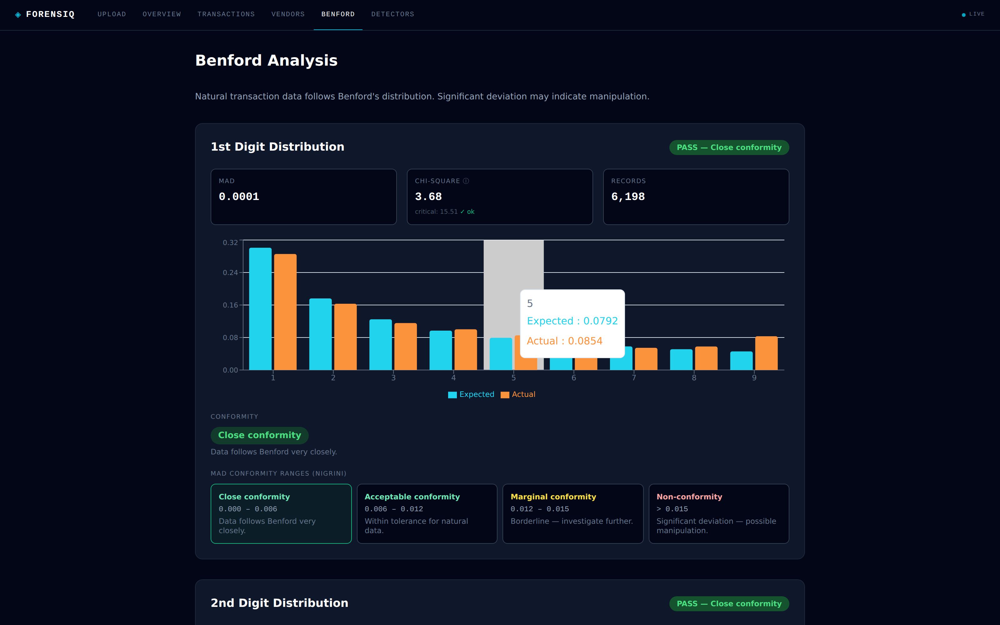
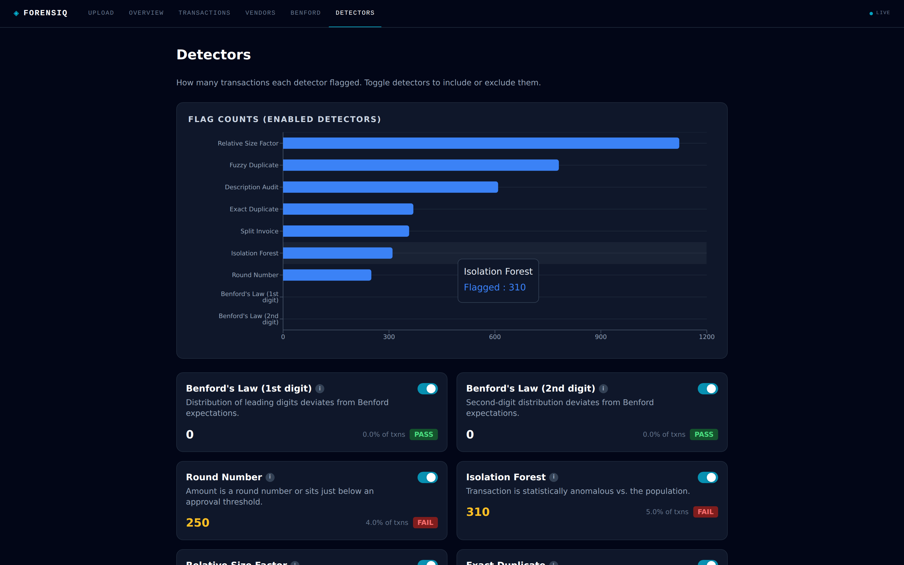
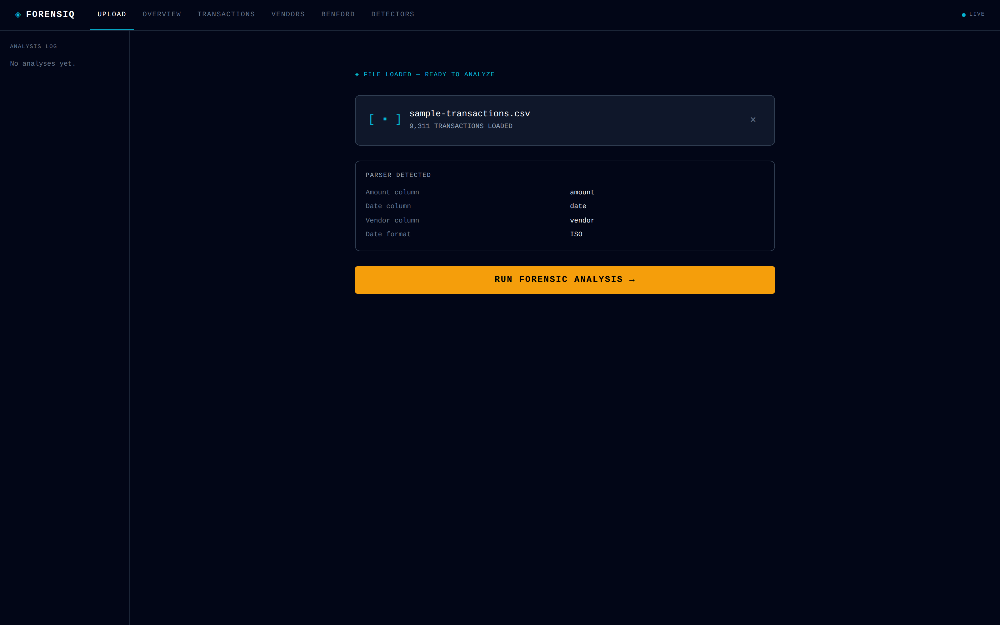

# ForensiQ

> Browser-based forensic accounting engine that surfaces fraud signals in a transaction ledger using statistical, ML, and pattern-based detectors — all running client-side so audit data never leaves the auditor's machine.

**Live demo:** https://forensiq-v2-phase1.vercel.app



---

## What it does

Drop a CSV of vendor payments. In a few seconds you get:

- A **portfolio risk score** (0–100) with a tiered breakdown (LOW / MEDIUM / HIGH / CRITICAL)
- **Per-transaction risk scores** with the specific detectors that fired
- A **Benford's Law** report on first- and second-digit conformity (Nigrini MAD ranges)
- A **vendor-level view** ranked by average risk score, click-through to all transactions
- An **Excel risk report** export for the audit work paper

Auditor data stays in the browser — there is no server-side persistence of transactions.



## Why this exists

Most billing fraud is statistically detectable. The ACFE 2024 Report on Occupational Fraud puts billing schemes at 28% of all asset-misappropriation cases, with a median loss of $180,000 per incident. The detection techniques — Benford's Law, relative-size factor analysis, duplicate clustering, anomaly detection — are well-documented in forensic accounting literature but live mostly inside expensive proprietary tools like ACL, IDEA, and Caseware.

ForensiQ packages those same techniques into a free, in-browser workflow.

## Detection layers

The pipeline runs nine detectors in three layers, then computes a composite score per transaction.

### Layer 1 — Statistical

| Detector | What it catches | Standard |
|---|---|---|
| **Benford's Law (1st digit)** | Fabricated invoices — humans pick digits non-uniformly (too few 1s, too many 5s/9s). Conformity classified by Nigrini's MAD thresholds. | ACFE Digital Analysis chapter |
| **Benford's Law (2nd digit)** | More sensitive to subtle manipulation than 1st-digit; flags "rounded-up to next dollar" patterns. | Nigrini 2012 |
| **Round number test** | Excessive `$X,000` or `$X,500` amounts → fabricated estimates rather than actual invoices. | ACFE Fraud Examiners Manual |

### Layer 2 — Pattern

| Detector | What it catches | Standard |
|---|---|---|
| **Isolation Forest** (200 trees, 0.05 contamination) | Outlier amounts: single huge payment to a small vendor, structuring patterns. | Liu et al. 2008 / sklearn defaults |
| **Relative Size Factor (RSF)** | `amount / vendor_median > 3.0` — surfaces $75k charges from a vendor that normally bills $5k. | AICPA AU-C 240.A22 |
| **Exact duplicates** | Same `date + amount + vendor` → vendor double-billed the same invoice. | AICPA AU-C 240.A25 |
| **Fuzzy duplicates** | Levenshtein-2 on vendor names within an amount band — catches "Meridian IT" vs "Meridan IT" shell-company aliasing. | ACFE Document Examination chapter |
| **Split invoices** | Three $9.3k payments from one vendor in five days → splitting a $28k purchase to evade a $10k approval threshold. | ACFE Billing Schemes chapter |

### Layer 3 — Text & external verification

| Detector | What it actually proves |
|---|---|
| **Description audit** | Vague descriptions ("Misc", "Consulting", "Services") and known fraud keywords. |
| **OFAC sanctions screen** | **Blocklist check.** Vendor name matched against the U.S. Treasury SDN feed (fetched live, ~10 MB XML, cached in module scope). Exact match, substring-of-entity match for distinctive entity names, and Levenshtein-2 fuzzy match for typo evasion. A hit escalates the transaction to score 100. Silence means *not sanctioned*, not "verified". |
| **EDGAR vendor lookup** | **Partial allowlist check.** Confirms a vendor is a registered SEC filer (~8k entities — public companies, investment advisors, broker-dealers). Most legitimate private vendors aren't in EDGAR, so absence isn't a failure on its own. The composite-score logic only escalates when *not in EDGAR* is paired with *RSF outlier* — i.e., "large invoice from an unverifiable vendor". |
| **Nominatim address geocoding** | **Sanity check.** Geocodes the vendor address via OpenStreetMap. Flags addresses that don't resolve at all or resolve to residential / mail-drop locations. Weaker signal than a real business-registry check (state Secretary of State filings) would be — but free, no API key. **Capped at the addresses of already-flagged vendors per analysis** to respect OSM's 1 req/sec policy: we re-verify suspicious-looking vendors specifically, rather than burning rate-limit budget on clean ones. |

### Composite scoring

`composite-score.ts` rolls each transaction's detector outputs into a 0–100 score with weights drawn from ACFE incidence rates, then assigns a `RiskTier` and aggregates portfolio-level metrics (estimated exposure, outlier rate, duplicate rate, etc.).

Per-transaction drill-down shows every detector's verdict — including the external checks — with PASS / FAIL / INFO / N/A status:



## Visual tour







## Architecture

```
┌─────────────────────────────────────────────────────────────┐
│  Browser (Next.js client)                                   │
│                                                             │
│   CSV → parseCsv (auto-detects amount column)               │
│        ↓                                                    │
│   ┌─────────────────────────────────────┐                   │
│   │  Web Worker — analysis.worker.ts    │                   │
│   │  ├─ 9 detectors (pure TS)           │                   │
│   │  └─ fetch /api/external-verify ─────┼──► EDGAR          │
│   └─────────────────────────────────────┘   OFAC            │
│        ↓ progress + result                  Nominatim       │
│   composite-score → portfolio rollup                        │
│        ↓                                                    │
│   IndexedDB-free localStorage history (gzip-compressed)     │
└─────────────────────────────────────────────────────────────┘
```

**Why a Web Worker?** Fuzzy Levenshtein is O(n²); a 200-tree isolation forest over 10k transactions takes 10–30 s. Running it on the main thread triggered the browser's "unresponsive page" dialog. The worker keeps the UI thread free for progress updates and interaction.

**Why client-side everything?** Auditors deal with sensitive financial data under privilege. Shipping a CSV to an unknown server is a non-starter for many firms. The trade-off is processing time — analysis runs in the user's CPU, not a fleet of servers — but for the typical 1k–10k transaction ledger that's acceptable.

**Type discipline.** `lib/types/transaction.ts` is the single source of truth. External data enters as `unknown` and is narrowed through type guards. No `any` in the detector code.

## How the ML actually works

ForensiQ uses one machine-learning technique: **Isolation Forest** (Liu, Ting & Zhou, 2008), an unsupervised anomaly-detection algorithm. The rest of the detectors are classical statistics (Benford's Law) or rule-based heuristics (RSF, duplicates, structuring). I'm specific about this because "ML project" can mean a lot of different things, and overselling reads worse than under-explaining.

### The 20-questions analogy

Imagine playing 20 questions about a person in a crowd. A *normal* person (average height, average age) takes lots of questions to identify — they blend in. A 7-foot-tall outlier? You can identify them in two questions. **Unusual things are easy to "isolate."**

Apply this to transactions. The algorithm picks a random split point in the amount range ("is amount > $73,205?") and divides transactions into two groups. It keeps splitting each group with new random questions until each transaction is alone in its own leaf — or the depth limit is hit. The number of splits required to isolate a transaction is its **anomaly score**: fewer splits = more anomalous.

A typical $5,000 invoice falls into a fat bucket with many similar ones — takes ~7-8 splits. A $750,000 invoice from a shell company sits alone at the top of the amount distribution — takes ~3 splits. The latter scores much higher.

### Why "forest"

One tree depends on the luck of which random splits happened to be useful. To smooth out the noise, the algorithm builds **200 trees**, each with different random splits, and averages the path lengths. A score becomes robust only when most of the 200 trees agree.

### Why ML and not just a threshold?

The intuitive alternative — "flag anything over $X" — falls apart immediately:

- The right threshold depends on the company. $50k is a red flag for a coffee shop, routine for a Fortune 500.
- The Isolation Forest **learns from the file you upload**. Its trees are built from *your* transactions' amount range, so the same algorithm correctly scores a coffee-shop ledger and a Fortune-500 ledger without retuning.
- We don't have labeled fraud examples to train a supervised classifier on. Unsupervised anomaly detection is the right tool for the problem.

### Deterministic by design

The random number generator is seeded with a fixed constant (`random_seed: 42` in `lib/fraud-logic/isolation-forest.ts`). Same CSV → same trees → same scores, every run. This is intentional: an auditor needs to defend their findings, and a non-deterministic score ("47 yesterday, 51 today, 49 just now") would be useless in a work paper.

The seed controls the *pattern* of randomness (the sequence `0.3741, 0.8124, 0.7234, …`); the data controls how those fractions become actual split values. Different CSVs produce different trees because they have different amount ranges, even though the random sequence is identical.

### What the model does *not* do

- It does not learn across analyses — each upload builds a fresh model and discards it after scoring. Per-engagement isolation is required for forensic work; data must not leak between clients.
- It does not predict future fraud, classify "fraud vs not fraud," or output labels — it produces a 0-100 anomaly score per transaction, ranked relative to other transactions in the same file.
- It does not use neural networks, embeddings, or LLMs. It is ~200 lines of TypeScript, runs in milliseconds in a browser, and was implemented from scratch in `lib/fraud-logic/isolation-forest.ts`.

## Using your own CSV

The parser is permissive by design — most real ERP exports work without column renaming.

**Auto-detected column aliases** (case-insensitive):

| Canonical field | Aliases the parser recognizes |
|---|---|
| amount | `amount`, `amt`, `total`, `value`, `invoice_amount`, **SAP** `dmbtr`, **Oracle** `entered_dr` |
| date | `date`, `invoice_date`, `posting_date`, `trans_date`, **SAP** `budat` |
| vendor | `vendor`, `vendor_name`, `supplier`, `payee`, `company`, **SAP** `lifnr` |
| invoice_id | `invoice_id`, `invoice_number`, `reference`, **SAP** `belnr` |
| description | `description`, `desc`, `memo`, `notes`, **SAP** `sgtxt` |
| address | `address`, `vendor_address`, `street_address`, `location` |

If no header matches the amount aliases, the parser **samples 20 rows and picks whichever column has the highest ratio of positive numeric values** ≥ 50% threshold. Currency symbols (`$`, `,`, whitespace) are stripped before parsing.

**After upload, a feedback card surfaces what was detected** — which columns mapped to which canonical fields, the inferred date format, the count of credit/refund rows excluded, and any unparseable rows. Catch parser misinterpretation before trusting the analysis.



**Date format**: the parser samples up to 50 dates and distinguishes ISO (`2024-05-15`) vs US (`05/15/2024`) vs European (`15/05/2024`) format. If a date column has any value with a first-slot number greater than 12, that proves DD/MM (since no month exceeds 12). If neither pattern is conclusive, the result is flagged "ambiguous" in the feedback card and the user is warned.

**Credits / refunds**: zero or negative amounts are no longer silently dropped — they're counted separately and excluded from the positive-amount detectors (they would distort RSF and Isolation Forest scoring).

### Things to watch out for

- **Excel files (.xlsx) not supported** — export to CSV first.
- **Mixed-currency ledgers** silently compare amounts directly (€1,000 and $1,000 look the same to the detectors). For a single-currency engagement this is fine; for multi-currency, pre-normalize before upload.
- **No header row**: the first line is always treated as headers. A header-less CSV will be misinterpreted.
- **UTF-8 only.** UTF-16 or Latin-1 will fail with encoding errors.

### Large datasets

A pre-analysis confirmation appears when row count exceeds 50,000 — analysis time is dominated by fuzzy-duplicate detection (O(n²) within ±20% amount bands). For ledgers over 20,000 rows, fuzzy duplicates skip the long-tail of below-median amounts to keep the analysis tractable while preserving signal where it matters (fuzzy-duplicate fraud almost always involves material amounts).

| Ledger size | Approximate analysis time | Notes |
|---|---|---|
| 1k–10k | 2–10 s | Smooth on any laptop |
| 10k–50k | 15 s – 2 min | Web Worker keeps UI responsive |
| 50k–100k | 2–8 min | Confirmation prompt before running |
| 100k+ | Untested | Browser memory may become the bottleneck |

## Tech stack

| | |
|---|---|
| Framework | Next.js 14 (App Router), React 18 |
| Language | TypeScript 5.4, strict mode |
| Styling | Tailwind CSS, shadcn/ui (Radix Nova) |
| Charts | Recharts |
| CSV | papaparse with column auto-detection |
| Compression | pako (gzip) for localStorage persistence |
| Excel export | xlsx |
| Testing | Jest + ts-jest, 38 passing tests |
| Deployment | Vercel |

## Local development

The Next.js app lives in `forensiq-v2/`, not the repo root.

```bash
cd forensiq-v2
npm install
npm run dev          # http://localhost:3000
npm run typecheck    # tsc --noEmit
npm test             # Jest
npm run build        # production build
```

There's a "Generate Sample" button on the upload screen if you don't have a CSV — it generates 500–10k synthetic transactions with embedded fraud patterns (shell vendors, duplicate invoices, split purchases, Benford-violating fabricated runs) for end-to-end testing.

## Roadmap

ForensiQ Phase 1 is a single-user, in-browser tool. Planned next:

**Input robustness**
- **Excel (.xlsx) parsing** on the upload path (the `xlsx` dependency is already used for export)
- **Multi-currency detection and base-currency normalization**
- **Encoding sniff** (UTF-16 BOM, Latin-1)
- **First-5-rows preview** with detected column highlighting before commit

**Large-dataset UX**
- **Sub-detector progress** — current loading overlay shows step granularity ("FUZZY DUPLICATES 7/12"); for very large files we'd surface within-step progress so the user knows the worker hasn't hung
- **Hard row cap with chunking guidance** for ledgers >500k rows

**Forensic coverage**
- **Server-side persistence** for multi-engagement audit firms (Supabase + RLS)
- **Diff mode** — compare current ledger to last quarter and surface deltas
- **Vendor master file analysis** — duplicate vendors with different bank accounts, vendors sharing addresses with employees
- **PDF audit work-paper export** with detector-by-detector commentary
- **Real-time mode** — Webhook from accounting system → screened in real time
- **Replace OFAC's regex XML parsing** with a proper SAX parser (current implementation is brittle to schema changes)
- **State-business-registry integration** — stronger "is this vendor real?" check than Nominatim geocoding alone

## Standards and references

- ACFE 2024 *Report to the Nations* — billing fraud incidence and median loss figures
- ACFE *Fraud Examiners Manual* — Billing Schemes, Digital Analysis, Document Examination chapters
- AICPA AU-C 240 — auditor's consideration of fraud
- Nigrini, M. (2012). *Benford's Law: Applications for Forensic Accounting* — MAD conformity ranges
- Liu, Ting, & Zhou (2008) — *Isolation Forest* (ICDM)

## License

MIT
